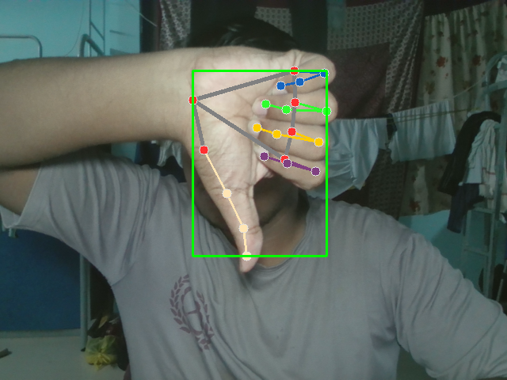
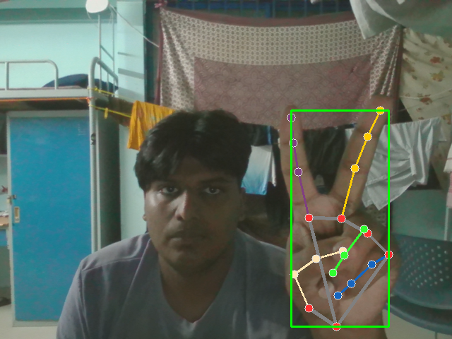

# ✋ Hand Gesture Recognition System

A real-time Hand Gesture Recognition System built using **Python**, **OpenCV**, and **MediaPipe**. The application detects hand landmarks from a webcam feed and recognizes predefined gestures to perform different computer actions such as taking screenshots.

---

## 📌 Features

- Real-time hand detection
- 21-point hand landmark tracking
- Gesture recognition using finger positions
- Screenshot capture using gestures
- Fast and lightweight
- Easy to customize with new gestures

---

## 🛠️ Technologies Used

- Python 3.11
- OpenCV
- MediaPipe
- NumPy
- PyAutoGUI

---

## 📂 Project Structure

```
Hand-Gesture-Recognition/
│
├── src/
│   ├── main.py
│   ├── detector.py
│   ├── gestures.py
│   └── utils.py
│
├── screenshots/
│
├── requirements.txt
│
├── README.md
│
└── LICENSE
```

*(Project structure may vary depending on your implementation.)*

---

## ⚙️ Installation

### 1. Clone the repository

```bash
git clone https://github.com/YOUR_USERNAME/Hand-Gesture-Recognition.git
```

### 2. Navigate to the project

```bash
cd Hand-Gesture-Recognition
```

### 3. Create Virtual Environment

Windows

```bash
python -m venv venv
```

Activate

```bash
venv\Scripts\activate
```

### 4. Install dependencies

```bash
pip install -r requirements.txt
```

---

## ▶️ Running the Project

```bash
python src/main.py
```

or

```bash
python main.py
```

(depending on your folder structure)

---

## ✋ Supported Gestures

| Gesture | Action |
|----------|--------|
| Peace ✌️ | Capture Screenshot |
| Open Palm | No Action |
| Fist ✊ | No Action |
| Thumbs Up 👍 | Customizable |
| OK 👌 | Customizable |

> Additional gestures can easily be added by modifying the gesture detection logic.

---

## 🧠 How It Works

1. Webcam captures live video.
2. MediaPipe detects hand landmarks.
3. Finger positions are analyzed.
4. A gesture is recognized.
5. Corresponding action is executed.

---

## 📸 Example Workflow

```
Camera
   ↓
MediaPipe Hand Detection
   ↓
21 Hand Landmarks
   ↓
Gesture Recognition
   ↓
Action Execution
```

---

## 📷 Screenshots
### Hand Detection

The application detects the user's hand and tracks 21 landmarks in real time.


### Screenshot Gesture

Making the Open Palm (🤚) gesture triggers automatic volume down.


---

### Screenshot Gesture

Making the Peace (✌️) gesture triggers automatic screenshot capture.



---

## 🚀 Future Improvements

- More gesture support
- Volume control
- Brightness control
- Mouse control
- Virtual drawing board
- Sign language recognition
- Gesture customization
- GUI for selecting actions
- Multiple hand support
- Machine Learning based gesture classification

---

## 📋 Requirements

```
opencv-python
mediapipe
numpy
pyautogui
```

or install using

```bash
pip install -r requirements.txt
```

---

## 🎯 Applications

- Human-Computer Interaction
- Touchless Interfaces
- Smart Homes
- Virtual Presentations
- Accessibility Systems
- Gesture-based Automation
- Education
- Gaming

---

## 📖 Learning Outcomes

Through this project, I learned:

- Computer Vision fundamentals
- MediaPipe hand tracking
- OpenCV image processing
- Real-time video processing
- Gesture recognition techniques
- Python application development

---

## 👨‍💻 Author

**Jeshwin V S**

B.Tech Computer Science and Engineering (AI & ML)

Rajadhani Institute of Engineering and Technology

---

## ⭐ If you like this project

Give this repository a ⭐ on GitHub.
